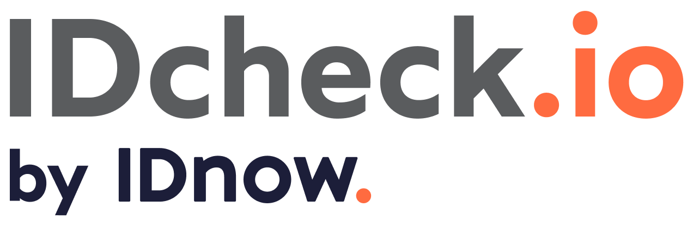

> 💡 For older IDCheckIOSDK sample (v5.x.x), please checkout the [sdk_v5](https://github.com/ariadnext/IDCHECK.IO_SDK-example-iOS/tree/sdk_v5) branch

# IDCheck.io Mobile SDK Sample for iOS

## Getting Started

To get this sample running, please follow the instructions :

 1. Ask our [Customer Success Managers](mailto:csm@idnow.com) for credentials to access the *IDnow* external repository in order to retrieve the **IDCheck.io Mobile SDK** library and integrate it to the project.

 2. To be able to fetch IDCheckIOSDK, you need to have a .netrc file with your credentials given by our team to let Cocoapods authenticate through our Nexus repository.
Just create a .netrc file in the root directory of your user and add the following lines :

  ```
    machine repoman.rennes.ariadnext.com
    login YOUR_LOGIN
    password YOUR_PASSWORD
  ```

3. Open your terminal and execute the following commands in order to install dependencies:

  ```shell
  $ cd idcheckio-sdk-sample-ios
  $ pod install --repo-update
  ```

  ⚠️ **Cocoapods v1.14 is needed** > More information at https://cocoapods.org/

4. Add your SDK's token
 With your application bundle identifier, ask the [Customer Success Managers](mailto:csm@idnow.com) to create an `idToken` to activate the SDK. You can then integrate it in your project using the **Token.swift** file or your own file or variable:

  ```swift
  import Foundation

  public enum Token: String {
    case demo = "YOUR_ID_TOKEN"
  }
  ```

5. Run the project

You are now good to go !

## Sample application
​
This sample project aims to showcase all possibilities of the **IDCheck.io Mobile SDK** and the associated best practices regarding these features. It also helps you understand how you can easily integrate the SDK, activate it and customise/adapt it to your application and business needs.
​
The main screen displays two buttons to choose between distinct capture flows :
​
 - **Online flow** : This flow uses the SDK for starting one session to capture only one document. You can configure wich type of document you want to capture with recommended configurations indicated in the *SDKConfig.swift* file.
 - **Onboarding flow** (**Recommended**) : This is a flow that allows you to chain several sessions (for example identity document + bioliveness). To configure the session you must contact [Customer Success Managers](mailto:csm@idnow.com).
​
Select the flow you want to try to start capturing documents with the SDK.
