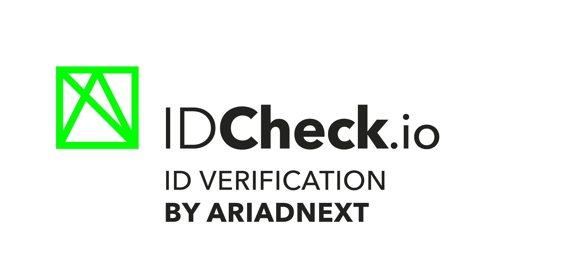

> 💡 For older IDCheckIOSDK sample (v5.x.x), please checkout the [sdk_v5](https://github.com/ariadnext/IDCHECK.IO_SDK-example-iOS/tree/sdk_v5) branch

# IDCheck.io Mobile SDK Sample for iOS

## Getting Started

To get this sample running, please follow the instructions :

 1. Ask our [Customer Success Managers](mailto:csm@ariadnext.com) for credentials to access the *ARIADNEXT* external repository in order to retrieve the **IDCheck.io Mobile SDK** library and integrate it to the project.

 2. To be able to fetch IDCheckIOSDK, you need to have a .netrc file with your credentials given by our team to let Cocoapods authenticate through our Nexus repository.
Just create a .netrc file in the root directory of your user and add the following lines :
```
  machine repoman.rennes.ariadnext.com
  login YOUR_LOGIN
  password YOUR_PASSWORD
```

3. Open your terminal and execute the following commands in order to install dependencies:
 ```
$ cd idcheckio-sdk-sample-ios
$ pod install
```

⚠️ Cocoapods v1.10 is needed.
> More information at https://cocoapods.org/


4. Add your SDK's licence

To be able to use the sample, please :

- Add your license file in the `idcheckio-sdk-sample-ios` folder of this project.
  - _(same directory as the `idcheckio-sdk-sample-ios.xcworkspace` and the `Podfile`)_
- Name it "**licence.axt**".

> 💡&nbsp;&nbsp; Do not forget to **edit the sample's app bundle identifier to match the one configured for your license**, otherwise the SDK will throw an invaid license error.

5. Run the project

You are now good to go !

## Sample application

This sample project aims to showcase all possibilities of the **IDCheck.io Mobile SDK** and the associated best practices regarding these features. It also helps you understand how you can easily integrate the SDK, activate it and customise/adapt it to your application and business needs.

The main screen displays a sliding tile to choose between four distinct capture flows :
 - **Online flow** : this flow uses the SDK for capturing an ID document first, and then continues with a Biometric Liveness session capture. It shows what you need to do in order to chain multiple online captures and keep transferring the *OnlineContext* through all these captures.
 - **Simple capture** : this flow has a specific selector to show you how to setup the SDK in order to capture a specific document (from ID to address proof, or even selfie).
 - **Advanced capture** : this flow is identical to the *Simple capture* regarding the SDK configuration, but it shows you how you can register your application as a listener to every SDK Interaction and display your own UI over the SDK. This way, yous can easily "override" the SDK while capturing a document and show your own designed screens and messages to the user.
 - **Analyze** : this flow uses the `Idcheckio.analyze` API which is useful when you don't want to use the camera feed for live-capturing and analyzing a document, but instead use a static image provided by the user from his phone's gallery.

Select the flow you want to try, and click on *Give it a try* button to start capturing documents with the SDK.